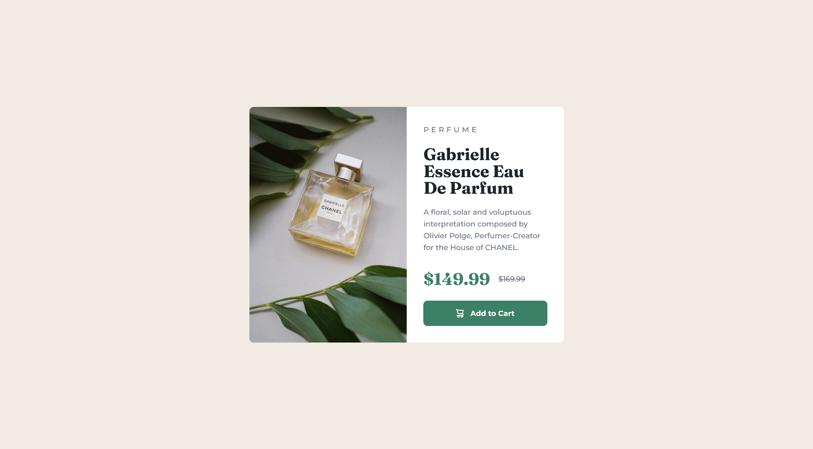

# Frontend Mentor - Product Preview Card Component Solution

My first Frontend Mentor Project!

This is a solution to the [Product Preview Card Component Challenge on Frontend Mentor](https://www.frontendmentor.io/challenges/product-preview-card-component-GO7UmttRfa). Frontend Mentor challenges help you improve your coding skills by building realistic projects. 

## Table of contents

- [Overview](#overview)
  - [The challenge](#the-challenge)
  - [Screenshot](#screenshot)
  - [Links](#links)
- [My process](#my-process)
  - [Built with](#built-with)
  - [What I learned](#what-i-learned)
  - [Continued development](#continued-development)
  - [Useful resources](#useful-resources)

## Overview

### The challenge

Users should be able to:

- View the optimal layout depending on their device's screen size
- See hover and focus states for interactive elements

### Screenshot

### Links

- [Solution](https://github.com/VasJM/product_preview_card_component)
- [Live Site](https://magnificent-pavlova-98acc6.netlify.app/)

## My process

### Built with

- Love 💖
- Semantic HTML5 markup
- CSS Custom Properties
- CSS Grid
- Mobile-first workflow

### What I learned

I learned the importance of having a proper and organized workflow when coding; from how to structure my HTML code, how and where to add classes, to how to add in my CSS systematically using a top-down approach. I've always approached building a website with a desktop-first workflow, but my first attempt at a mobile-first approach allowed me to see how much easier, and better, this way was.

### Continued development

I want to continue learning how to better utilise more HTML tags like `article`, `section`, `picture` (as opposed to just using a `div`), as well as HTML's `data-*` attribute. With CSS, I have always defaulted to using `flex`, but using `grid` is something I want to explore more in depth. This project introduced me to working with `SVGs` for the first time so I would love to continue working with them. Overall, this is only just the beginning, and I have a lot more to learn 🤙

### Useful resources

[MDN Docs](https://developer.mozilla.org/en-US/) my most beloved, I would be so lost without her 💖 And some other resources I used in this project:
- [Josh Comeau's Modern CSS Reset](https://www.joshwcomeau.com/css/custom-css-reset/)
- [Scott O'Hara's Blogpost on How to INCLUSIVELY Hide Content](https://www.scottohara.me/blog/2017/04/14/inclusively-hidden.html)